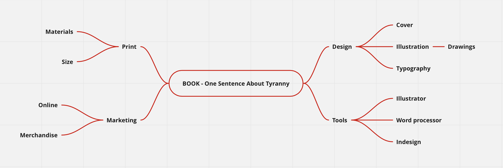

# One Sentence About Tyranny#

  
Mind Map

  

## Voice & Tone
- Voice: Informative, 
- Tone: Neutral, formal

## Outline
- asa
- Research
- Comunication with translator
- Creation of illustrations
- Promotional merchendise

## Notes

## Keywords

Poetry
Bilingual
Book
Printed publication
Illustration
Visual translation
Typeface
Book cover
Visual style

## References

