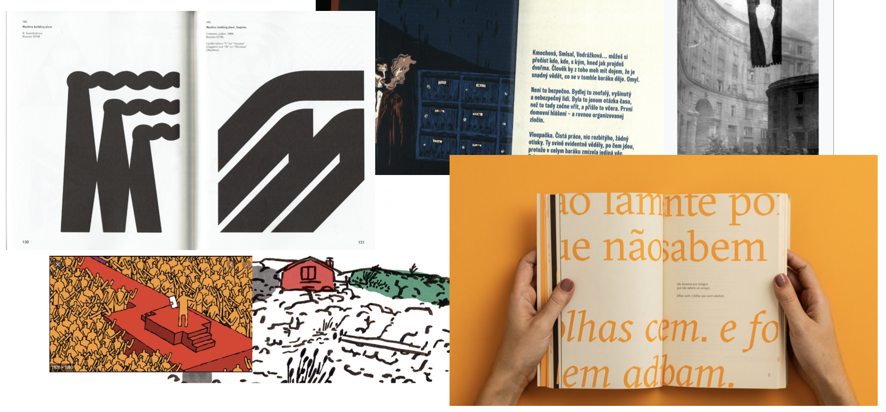

# Design of the bilingual printed publication
### by Michal Hornof

30/3/2021

### Keywords:
Gyula Illyés, Hungary, Czech, language, bilingual, book, print, cover design, typoghaphy, graphic design, illustration, poetry, communism

### In my thesis I wanted deal with:

Book design
Advertising campaignn
Merchendising

## Book design
### Moodboard

 

When I designed the book, I wanted to evoke in the reader as much as possible the same feeling as he can have from the poem itself. 
So key items were for me:

<li>Rawness</li>
<li>Gradation</li>
<li>Red color</li>
